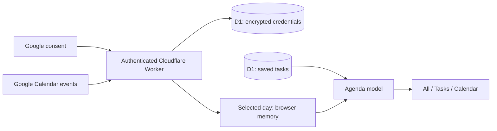

# Google Calendar in Good day

Good day overlays the primary Google calendar onto the selected day's task schedule. Google remains the source of truth for events; the planner database remains the source of truth for tasks. This is a read-only integration. Creating or completing a task does not create or modify a Google event.

## Boundaries

- `google-calendar.mjs`: authenticated connect/status/complete/events/disconnect endpoints. OAuth state and PKCE bind consent to a user, session, and allowed origin. Credentials are encrypted with AES-GCM and user-bound associated data. Session tokens, rather than Google tokens, authorize browser requests.
- Google event requests expand recurring instances, follow pagination, exclude cancelled and declined invitations, and request only fields needed by the UI and scheduling. The primary calendar is the only queried calendar. A partial pagination failure returns an error rather than an incomplete schedule.
- `calendar-model.mjs`: converts events into local wall-clock intervals for the selected date, clips overnight events, and treats all-day end dates as exclusive. The day request uses local midnight boundaries, including daylight-saving days.
- `agenda.mjs`: combines saved tasks with calendar intervals before applying a display filter. Busy timed events reserve time; free and all-day events do not. Fixed tasks keep their chosen times and flag conflicts. Filtering cannot change scheduling or task progress.
- `app.mjs`: owns connection state, selected date, refresh generation, errors, and view choice. Requests from an older date or connection generation cannot overwrite the current view. Disconnect invalidates pending reads; new refreshes are blocked during connect/disconnect. Event data never becomes planner task data.
- `workspace.css`: a capped-width agenda with connection controls and view filters outside the scroll region. All-day events are inside that region so a calendar with many events cannot push the page beyond the viewport. `workspace.mjs` moves task entry and the timer into dialogs on smaller screens.

## Connection states

| State | Planner behavior | Action |
| --- | --- | --- |
| Not configured | Tasks work; setup status appears only in Account/onboarding | Open Account |
| Disconnected | Tasks work without external reservations; no setup banner in agenda | Connect from Account or onboarding |
| Loading | Existing same-day events remain visible while refreshing | Refresh disabled |
| Connected | Event count, last refresh time, local time zone, and view filters | Refresh or manage connection |
| Empty day | Calendar view explicitly says there are no Google events | Change day or add tasks |
| Refresh failed | Retains last successful same-day events with a stale notice | Retry |
| Reconnect required | Clears unusable event data and prompts reauthorization | Reconnect |
| Disconnected after use | Clears credentials and browser events; recalculates tasks | Connect again if wanted |

Automatic refresh runs every five minutes while visible and on return after a minute away. Changing days clears prior-day event data before fetching. A failed new-day fetch never reuses yesterday's events. External reservations affect only the computed schedule; automatic start times are not written back to task records. Consequently refresh or disconnect may move automatically arranged tasks, while fixed tasks keep their explicit start times.

## Data lifecycle and deployment

Event data is transient on the Worker and in browser memory. Credentials persist encrypted in D1 until disconnect; Google revocation is attempted after local removal. The browser persists only its planner session and temporarily preserves a task draft across OAuth navigation. No push subscriptions, webhook service, event database cache, or Google event-write scope is needed for this architecture.

Production credentials and Google verification are separate from local code verification. Follow [Google Calendar setup](GOOGLE-CALENDAR-SETUP.md) for the client, redirect URI, Worker secrets, schema, and deployment. Real consent requires a configured Google client and authorized account; automated tests mock Google and cannot establish that production configuration is complete.

## Verification

`node --test dog/tests/model.test.mjs dog/tests/google-calendar.test.mjs dog/tests/agenda.test.mjs` covers OAuth binding, encryption, token refresh/revocation, pagination, event conversion, date boundaries, fixed conflicts, and filter-independent scheduling.

`node dog/tests/calendar-browser.mjs` uses the isolated local backend and mocked Google responses to verify combined views, task creation around busy time, conflicts, task-only progress, stale states, date changes, reconnect/disconnect, and connected layouts at desktop and phone sizes.

References: [Google events.list](https://developers.google.com/workspace/calendar/api/v3/reference/events/list), [Google Calendar scopes](https://developers.google.com/workspace/calendar/api/auth).
